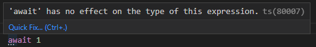

# Disallow typescript suggestion messages which are usually only displayed in IDEs (`detachhead/suggestions-as-errors`)

<!-- end auto-generated rule header -->

## Rule Details

this rule reports suggestions like this from the typescript compiler as errors:



Examples of **incorrect** code for this rule:

```ts
// Import may be converted to a default import.
import * as ts from 'typescript'

// 'await' has no effect on the type of this expression.
const foo = await 1
```

Examples of **correct** code for this rule:

```ts
import ts from 'typescript'

const foo = 1
```

## Options

```js
// .eslintrc.js
const config = {
    // ...
    rules: {
        'detachhead/suggestions-as-errors': [
            'error',
            {
                exclude: [80001], // File is a CommonJS module; it may be converted to an ES module
            },
        ],
    },
}
```

### `include`

suggestion codes to include. defaults to all codes

### `exclude`

suggestion codes to exclude. if a code is included in both `include` and `exclude`, the code is excluded.
